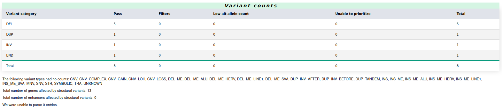
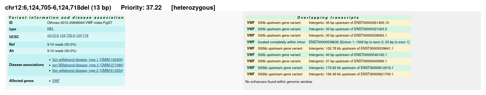
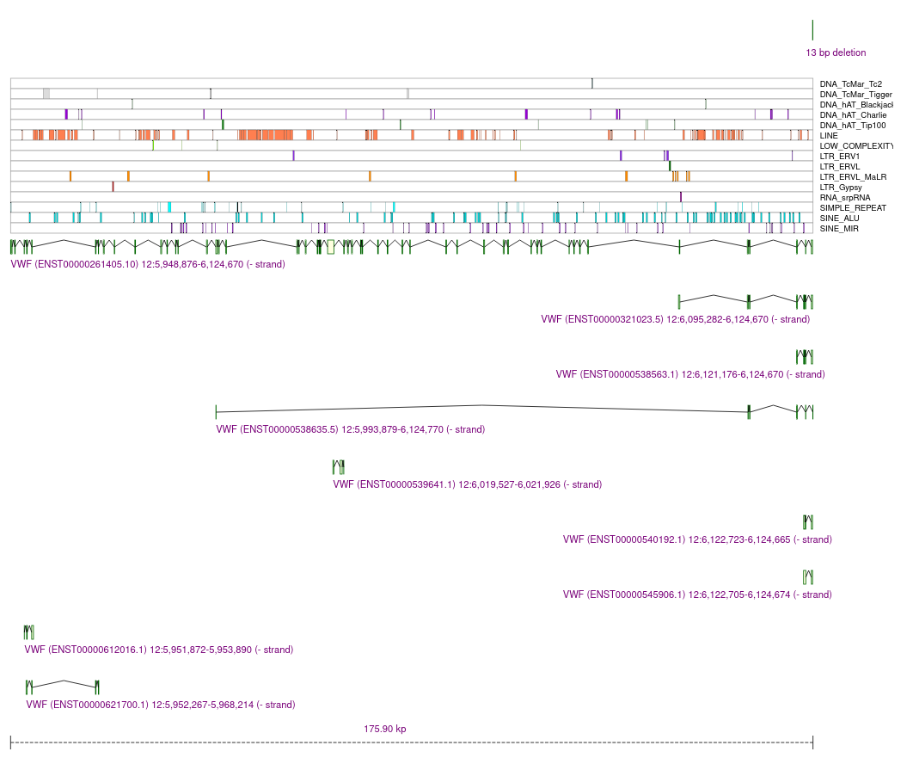

# SvAnna - Structural Variant Annotation and Analysis

[](https://github.com/TheJacksonLaboratory/SvAnna/releases)
[](https://github.com/TheJacksonLaboratory/SvAnna/actions/workflows/maven.yml)
[](https://svanna.readthedocs.io/en/master/?badge=master)

Efficient and accurate pathogenicity prediction for coding and regulatory structural variants in long-read genome sequencing.

Most users should download the latest SvAnna distribution ZIP file from
the [Releases page](https://github.com/TheJacksonLaboratory/SvAnna/releases).

## Example use

SvAnna is a standalone command-line Java application and can be run as follows:

```shell
java -jar svanna-cli.jar -d path/to/svanna/data \
  -t HP:0008330 \
  --vcf example.vcf.gz \
  --output-format html,csv,vcf
```

The analysis will filter out common SVs and perform phenotype-driven prioritization of the remaining SVs. 
The SVs are assigned with *"Pathogenicity of Structural variation"* (PSV) score and written into 
one of several output formats, such as CSV table, a VCF file, or a detailed HTML report.

### HTML report

The HTML report includes a header with the analysis summary and the SVs ordered by the PSV score 
with the best scores on top.

### Analysis summary

The summary presents the clinical features encoded into terms of Human Phenotype Ontology (HPO) as well as 
the other analysis parameters.


### Variant counts

The report further breaks down SVs into several categories:



### Structural variants

Last, each SV is presented in the context of the overlapping genes and transcripts:


We also show the variant in context of the neighboring repetitive regions and genes/transcripts:



## Read more

Please consult the Read the docs site for a detailed documentation:
- [stable version](https://svanna.readthedocs.io/en/master) describing the latest release at the *Releases page*, or
- [latest version](https://svanna.readthedocs.io/en/latest) summarizing the latest development on `development` branch.

Check out SvAnna manuscript in [Genome Medicine](https://doi.org/10.1186/s13073-022-01046-6).
