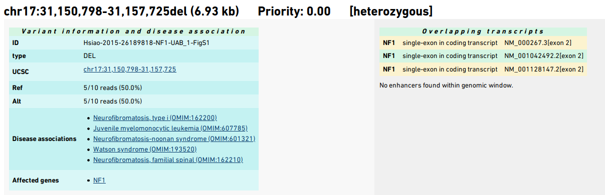
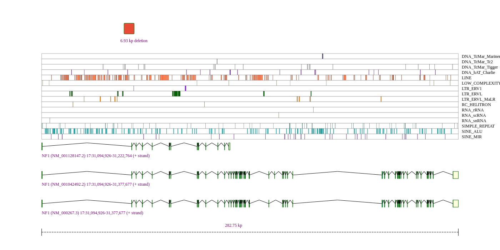
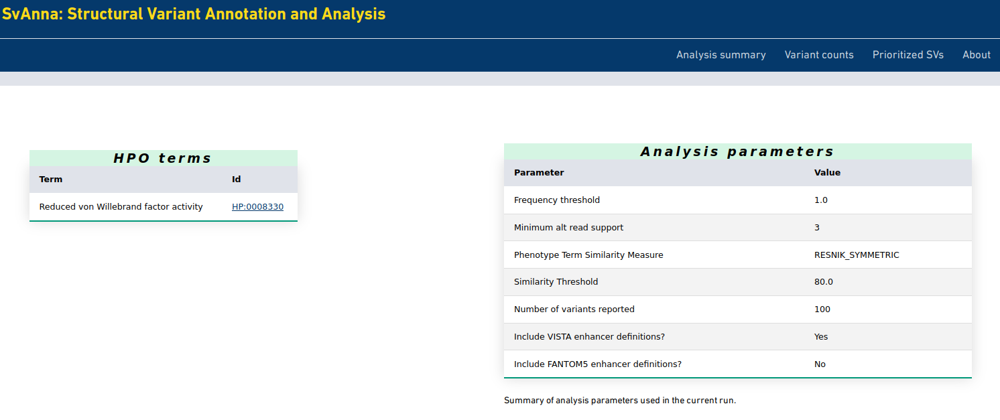
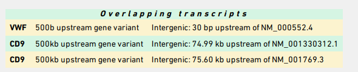
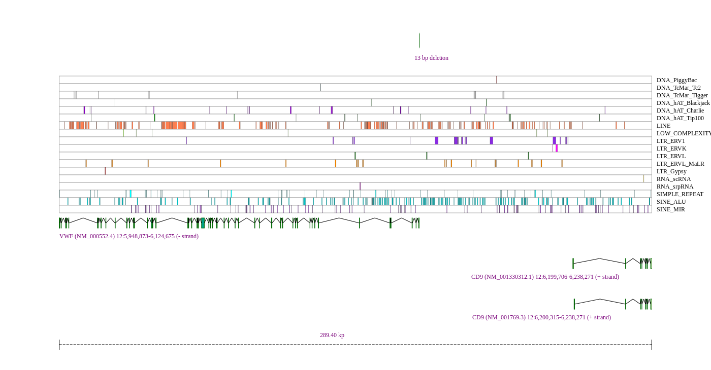

.. _rsttutorial:

################
SvAnna: Tutorial
################

Structural variation (SV) is generally defined as a region of DNA approximately 1 kb and larger in size
(`Freeman et al., 2006 <https://pubmed.ncbi.nlm.nih.gov/16809666/>`_). SV includes
inversions and balanced translocations or genomic imbalances (insertions and deletions),
often referred to as copy number variants (CNVs).

SvAnna is intended to be used to annotate and interpret VCF files representing the results of
long-read genome sequencing using approaches for calling SVs. SvAnna was specifically designed
for VCF files produced by long-read sequencing variant callers such as `pbsv <https://github.com/PacificBiosciences/pbsv>`_ or
`sniffles <https://github.com/fritzsedlazeck/Sniffles>`_.

This tutorial intends to be a start-to-finish example. Before you begin the tutorial, follow the instructions in
:ref:`rstsetup` to setup SvAnna on your system. Make sure you have downloaded or created the SvAnna database files and set the mandatory entries in the ``svanna-config.yml`` file.

Input: (1) A structural variant VCF file
########################################

SvAnna will work with any VCF file with structural variants. We note that in practice, SV callers designed for short-read
sequencing (such as Illumina) do not call the full range of SVs that are called by callers designed for long-read sequencing.

For demonstration purposes, we have prepared a VCF file that contains only the 8 variants described in the SvAnna manuscript.
If you have a VCF file on hand that was called with a caller such as `pbsv <https://github.com/PacificBiosciences/pbsv>`_ or
`sniffles <https://github.com/fritzsedlazeck/Sniffles>`_, or `SVIM <https://github.com/eldariont/svim>`_, it can be used instead or
you can add the 8 variants to the end of that file to simulate a "real-life" long-read seuqencing experiment.

The file with the 8 variants can be downloaded here: `svanna-cli/src/examples/example.vcf <https://github.com/TheJacksonLaboratory/SvAnna/blob/master/svanna-cli/src/examples/example.vcf>`_.

Running SvAnna in VCF-only mode
###############################

It is possible to run SvAnna without phenotype data, i.e., using just a VCF file as input.

.. code-block:: console

    $ java -jar svanna-cli.jar prioritize -c svanna-config.yml --vcf example.vcf

This will output an HTML file called `example.SVANNA.html` in the same directory as the input VCF file.
SvAnna outputs information about each of the SVs in the VCF file. Two main sections are generated for each SV. The top section
has a summary of the variant, the affected gene(s) and disease(e), and lists the predicted effect of the SV on each overlapping transcript.

The bottom section is a figure that is embedding as an SVG file directly into the HTML output. The figure shows the SV and its overlaps
with repeating elements, enhancers, dosage sensitive regions, and transcripts.
The genomic locations and strand of the transcripts as well as the total extent of the viewport are shown.

Input: (2) Phenopacket
######################

SvAnna can also be run in a phenotype-aware mode in which candidate SVs are assessed according to their clinical relevance. The
input in this case contains both a VCF file as well as `Human Phenotype Ontology (HPO) <https://hpo.jax.org/app/>`_ terms that
describe clinical manifestations in the individual being examined by diagnostic sequencing.
To do so, SvAnna expects to have a Phenopacket as an input.

The Phenopacket Schema represents an open standard for sharing disease and phenotype information to improve our ability
to understand, diagnose, and treat both rare and common diseases. A Phenopacket links detailed phenotype descriptions
with disease, patient, and genetic information, enabling clinicians, biologists, and disease and drug researchers to
build more complete models of disease. See the `GA4GH documentation <https://phenopacket-schema.readthedocs.io/en/latest/basics.html>`_ for more information.

Importantly, to run SvAnna with a Phenopacket, the path of the VCF file needs to be recorded in the Phenopacket. This can
be done in a text editor but we recommend the `PhenopacketGenerator <https://github.com/TheJacksonLaboratory/PhenopacketGenerator>`_ for
convenience -- enter the HPO terms and the path to the VCF file.

The following is a minimal Phenopacket (note this is version 1, we will add support for the v2 in near future). ::

    {
    "id": "example",
    "subject": {
        "id": "example",
        "ageAtCollection": {
        "age": "P2Y"
        }
    },
    "phenotypicFeatures": [{
        "type": {
            "id": "HP:0008330",
            "label": "Reduced von Willebrand factor activity"
        }
    }],
    "htsFiles": [{
        "uri": "file:///***/***/example.vcf",
        "htsFormat": "VCF",
        "genomeAssembly": "hg38"
    }],
    "metaData": {
        "created": "2021-07-13T15:08:53.846Z",
        "createdBy": "ExampleOrg:ExampleCurator",
        "resources": [{
            "id": "hp",
            "name": "human phenotype ontology",
            "url": "http://purl.obolibrary.org/obo/hp.owl",
            "version": "unknown HPO version",
            "namespacePrefix": "HP",
            "iriPrefix": "http://purl.obolibrary.org/obo/HP_"
            }],
        "phenopacketSchemaVersion": "1.0.0"
        }
    }

To run this on your system, replace the path for the VCF file (``file:///***/***/example.vcf``). For instance, if you
have the VCF file at ``/home/myname/data/example.vcf``, the line should read ``"uri": "file:///home/myname/data/example.vcf"``.

This phenopacket file can be downloaded here: `svanna-cli/src/examples/example-phenopacket.json <https://github.com/TheJacksonLaboratory/SvAnna/blob/master/svanna-cli/src/examples/example-phenopacket.json>`_.
Note however, that you will need to adjust the path to the VCF file as described just above.

This command will prioritize the SVs according to phenotypic relevance. We entered a single HPO term,
`Reduced von Willebrand factor activity <https://hpo.jax.org/app/browse/term/HP:0008330>`_. The term and a summary of
the analysis parameters is shown near the top of the SvAnna HTML page.

Phenotype prioritization against the `Reduced von Willebrand factor activity <https://hpo.jax.org/app/browse/term/HP:0008330>`_. causes
the SV affecting the *VWF* gene to be most highly prioritized variant. It is a 13 bp deletion that is located between the
*VWF* and *CD9* genes. It is scored as a promoter variant by SvAnna because the deletion is only 30 bp upstream of a VWF transcript,
while it is about 75.60 kb downstream of *CD9*.

The deletion is visualized as follows.

And that's it! If you encounter any problems, please create an issue on the SvAnna `tracker <https://github.com/TheJacksonLaboratory/SvAnna/issues>`_.